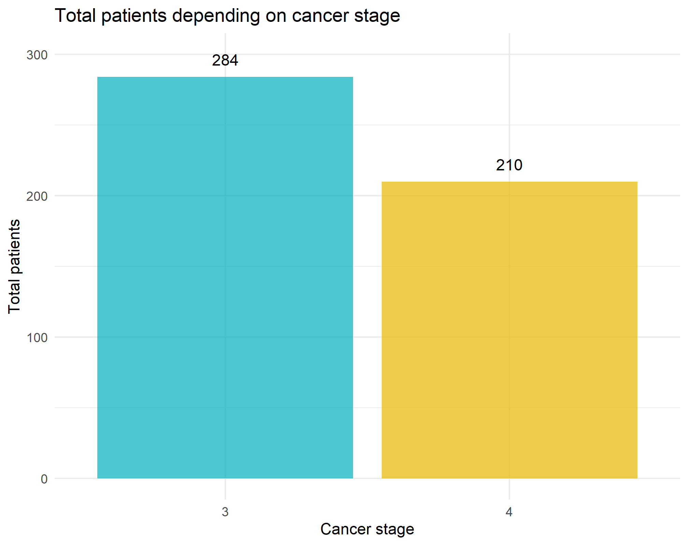

```{r setup, include=FALSE}
knitr::opts_chunk$set(echo = FALSE)
```
 
## Introduction (1/2)
### Study objective
The main objective of this study is to analyze the relation between survival of patients with prostatic cancer when given different treatments with estrogen medication. 

## Introduction (2/2)
### Study data
Data was obtained from a randomized clinical trial.

## Methods(1/..)
### Data flow


## Results and discussion
### PCA analysis


## Result and discussion 2


## Result and discussion 3


## Result and discussion 4


## Result and discussion 5

## Slide with Bullets

- Bullet 1
- Bullet 2
- Bullet 3

## Slide with R 

```{r cars, echo = TRUE}
summary(cars)
```

## Slide with Plot

```{r pressure}
plot(pressure)
```

## Slide uploading png image

{width=90%} 

