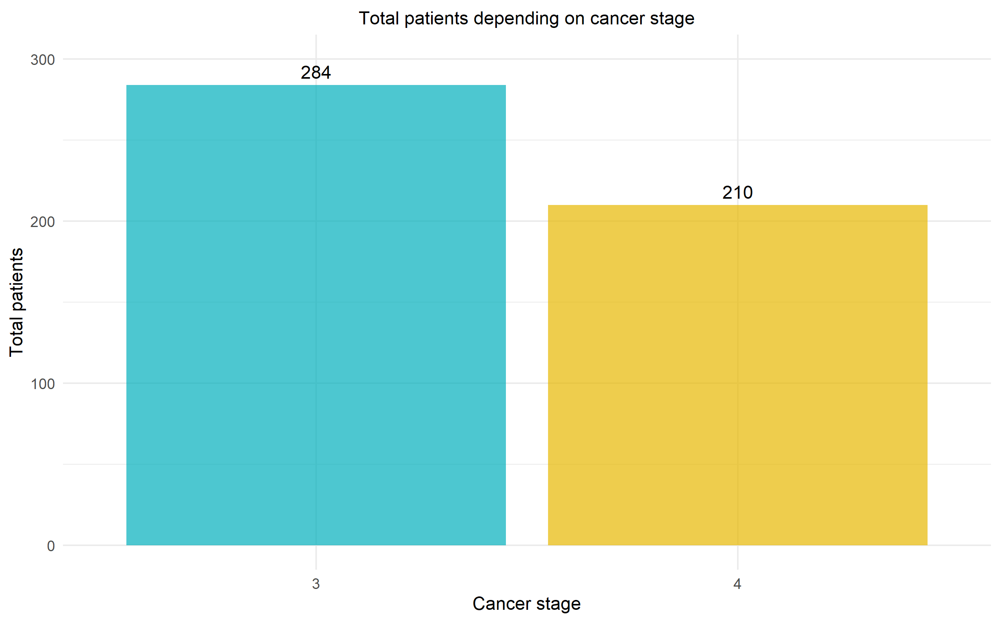

```{r setup, include=FALSE}
knitr::opts_chunk$set(echo = FALSE)
```
 
## Introduction


## Methods


## Results and discussion
### PCA analysis


## Visualizing our data -> work in progress (Dayana)
- In the dataset the is 284 patients in stage 3 cancer, and 210 in stage 4 cancer.
- There are no patients with cancer stage 1 or 2 
{width=50%}


## Result and discussion 3 


## Result and discussion 4


## Result and discussion 5

## Slide with Bullets

- Bullet 1
- Bullet 2
- Bullet 3

## Slide with R 

```{r cars, echo = TRUE}
summary(cars)
```

## Slide with Plot

```{r pressure}
plot(pressure)
```

## Slide uploading png image

{width=90%} 

