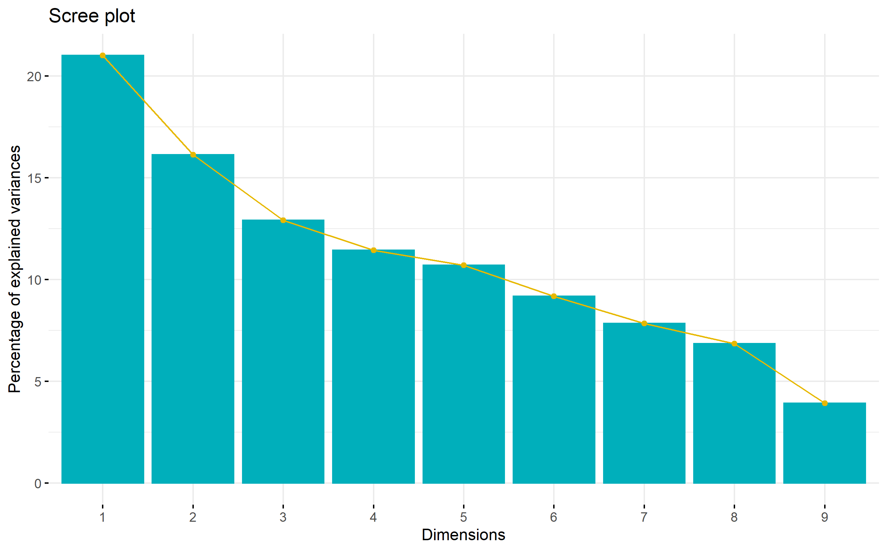
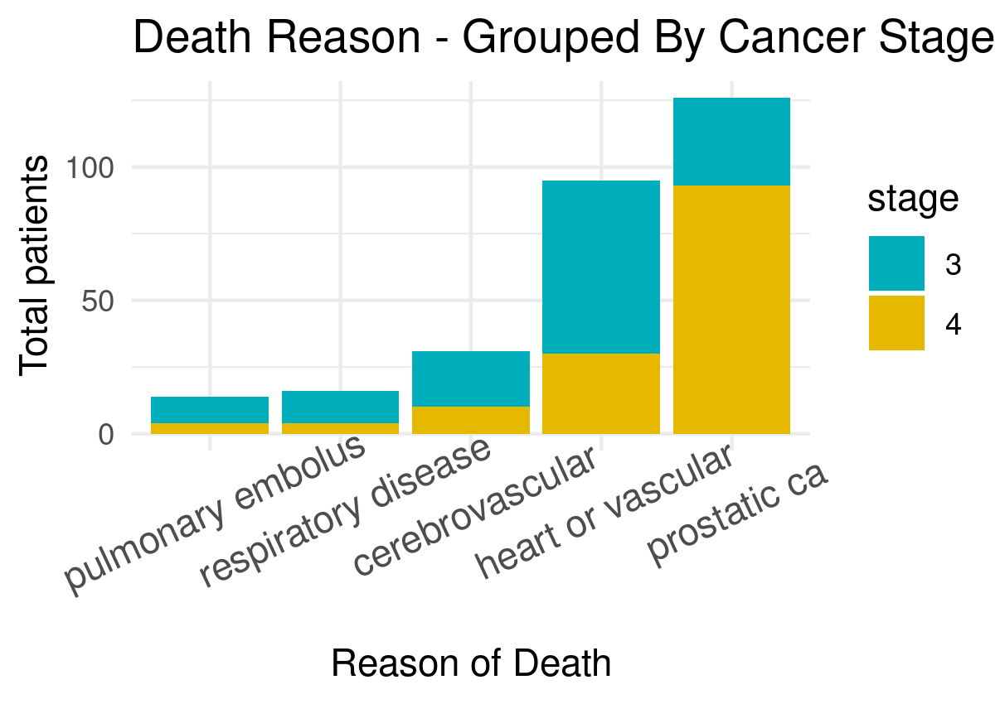
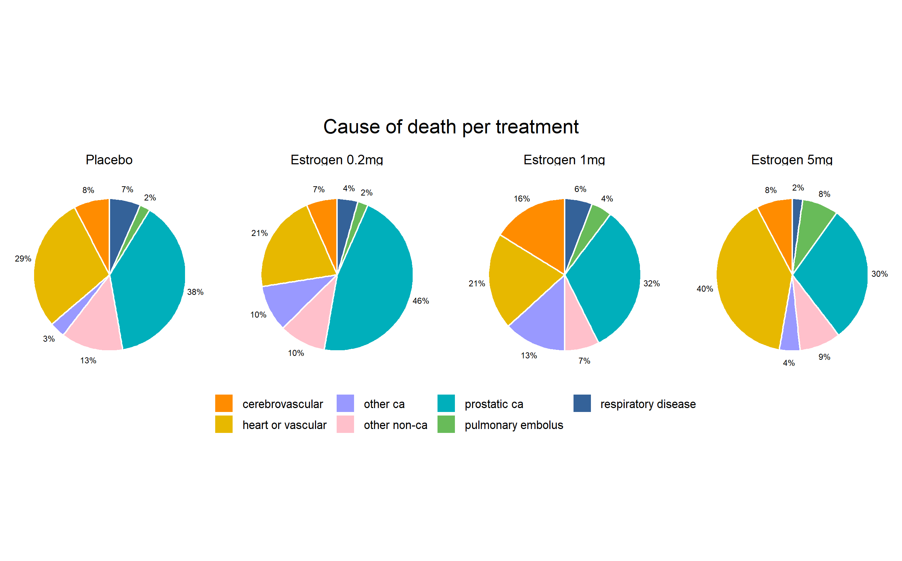
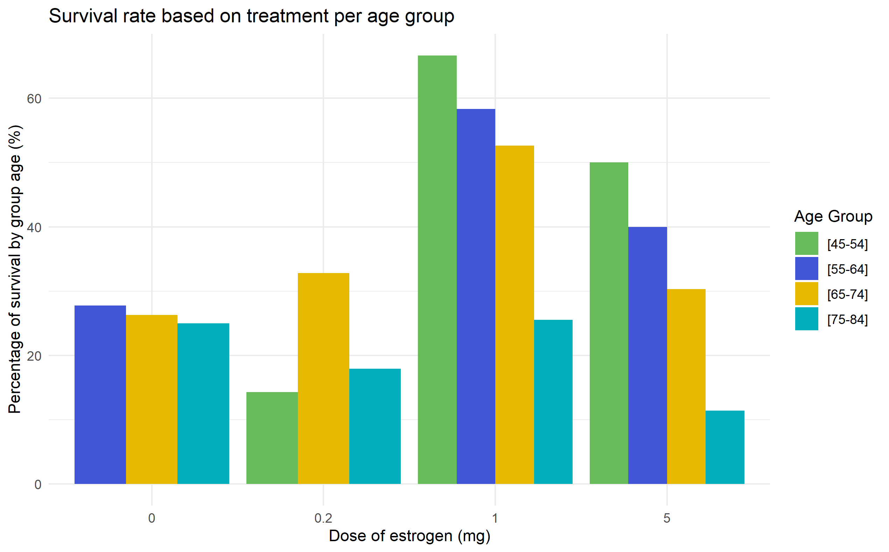
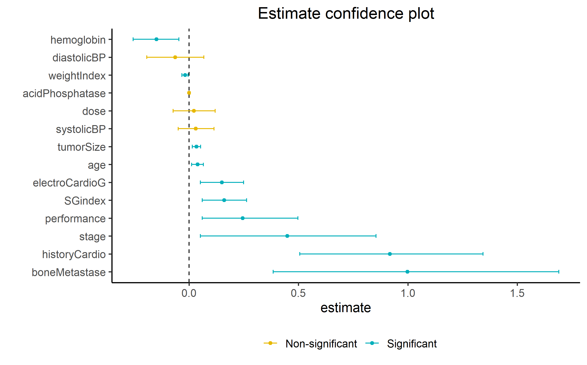

```{r setup, include=FALSE}
knitr::opts_chunk$set(echo = FALSE)
```
 
## Introduction (1/2)
### Study objective

Analyze the relation between survival of patients with prostatic cancer when given different treatments with estrogen. 

Patients might be in different stages:

- Stage 3: No distant metastasis 
- Stage 4: Distant metastasis detected

Four used treatments:

- Placebo
- 0.2 mg diethylstilbestrol (DES)
- 1.0 mg DES
- 5.0 mg DES

## Introduction (2/2)
### Study data
- Study data was obtained from a randomized clinical trial.
- The starting point for this project was a CSV file attached with the study.
- Total amount of 502 patients --> 502 rows
- Initially 18 attributes, but we will work with 16 --> 16 columns
- 4 categorical attributes and 12 numeric
- Columns containing numerical and categorical information ("0.2 mg estrogen")
- 27 NAs found 

## Methods(1/..)
### Data flow


## Results and discussion
### PCA analysis
With the objective of getting a differentiation in the status (dead/alive), a PCA analysis was done to analyze attributes relevance and data distribution in space.

```{r image_grobs, fig.show = "hold", out.width = "50%", fig.align = "default"} 
knitr::include_graphics("../results/07_PCA_continuous.png")

```

## Results and discussion
### PCA analysis

However, some information about the attributes that the PCA found to be more relevant are:

{width=65%}


## Visualizing our data (1/?) 
- In the dataset the is 284 patients in stage 3 cancer, and 210 in stage 4 cancer.
- There are no patients with cancer stage 1 or 2 
{width=50%}


## Visualizing our data (2/?)  
- With the higher cancer stage, we can see a skew to higher tumor sizes
- expected since is more advanced stage where tumor has spread to other tissues
{width=50%}

## Visualizing our data (3/?)  
- deaths caused directly by prostate cancer have a higher component by stage 4 tumors
- stage 4 characterize by spreading to more tissues and has a worse prognosis
{width=50%}

## Visualizing our data (4/?)
- higher cancer stage, there is a higher measurement of acid phosphatase, a blood indicator related to prostate cancer.
- There is also a higher SG Index, which refers to histologic grade (well differenciated to undifferenciated)
{width=50%}

## Visualizing our data (5/?)   -> need bullet points (Maria)
{width=50%}

## Visualizing our data (6/?)   -> need bullet points (Maria)
{width=50%}

## Visualizing our data (7/?) 
- There is 16% of patients in stage 4 with bone metastases
{width=50%}

## Visualizing our data (8/?)  
- blood pressure (diastolic and systolic), dosage of treatment, and acid phosphatase levels where founf to be non-significant fro the survival rate.
- The most significant variables were bone metastases, history of cardiovascular disease and cancer stage.

{width=50%}

## Visualizing our data (9/?)   
- The manhattan plot corroborates the previous slides observations

{width=50%}

## K-mean clustering   
-For k-mean clustering we used k = 2 (dead, alive).
-We excluded the variables found as non-significant.
-The model had an accuracy of ~60%.
{width=50%}

## Discussion - to be done


## Slide with R 

```{r cars, echo = TRUE}
summary(cars)
```

## Slide with Plot

```{r pressure}
plot(pressure)
```


