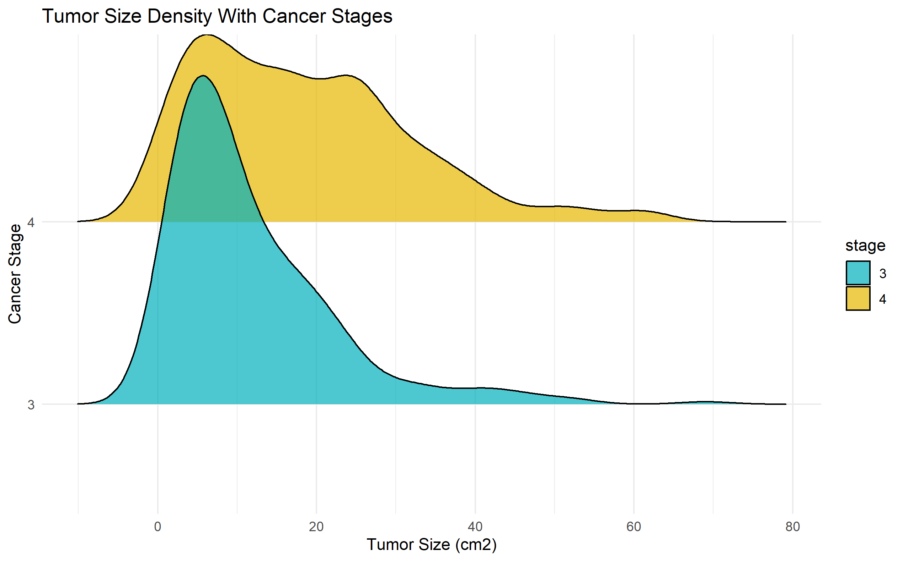
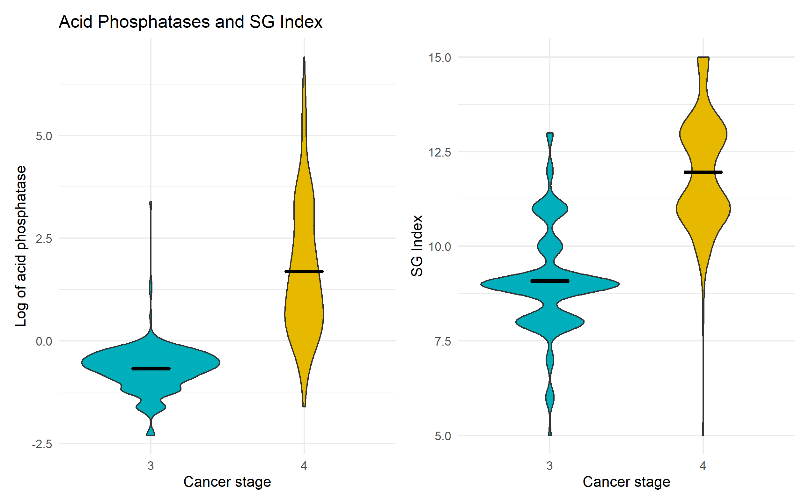
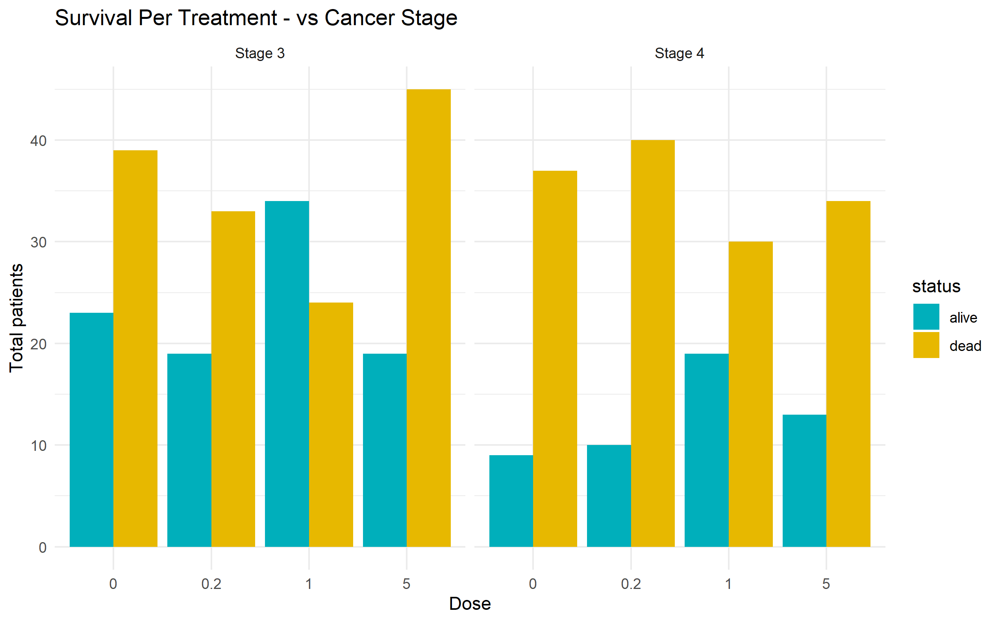

```{r setup, include=FALSE}
knitr::opts_chunk$set(echo = FALSE)
```

## Introduction {.smaller}  
### Study objective 

Analyze the relation between survival of patients with prostate cancer when given different treatments with estrogen and other relevant clinical parameters. 

Patients might be in different stages:

- Stage 3: No distant metastasis 
- Stage 4: Distant metastasis detected

Four used treatments:

- Placebo
- 0.2 mg diethylstilbestrol (DES)
- 1.0 mg DES
- 5.0 mg DES


## Materials & Methods (1/3) {.smaller}
### Study data
- Study data was obtained from a randomized clinical trial https://biostat.app.vumc.org/wiki/pub/Main/DataSets/prostate.xls
- The starting point for this project was a CSV file attached with the study.
- Dimention of the data:
<center>
{width=70%}
</center>
- 1 Column containing both numerical and categorical information ("0.2 mg estrogen").
- 1 Column containing info of patient status and death reason together ("dead - cerebrovascular").
- 27 NAs found in total.


## Materials & Methods (2/3) {.smaller} 

<center>
{width=80%}
</center>

## Materials & Methods (3/3) {.smaller}
- Two datasets are joined into one by their patient IDs.
- Two columns are dropped (date on study and follow up time).
- All the columns are renamed.
- NAs in 4 different numeric columns replaced with their mean values.
- NAs in 1 categorical column are dropped (8 rows).
- New columns are created: dose, treatment, status, reasonDeath and reasonDeathNum

<center>
{width=60%}
</center>


## Data Visualization 1 {.smaller}  
- There is 284 patients in cancer stage 3, and 210 in stage 4.
- There are no patients with cancer stage 1 or 2.

<center>
{width=65%}
</center>

## Data Visualization 2 {.smaller}   
- With a higher cancer stage, we can see a skew to higher tumor sizes.
- This is expected since a tumor spreads to other tissues in an advanced stage.

<center>
{width=60%}
</center>

## Data Visualization 3 {.smaller}   
- Deaths caused directly by prostate cancer have a higher component by stage 4 tumors.
- Stage 4 characterize by spreading to more tissues and has a worse prognosis.

<center>
{width=60%}
</center>

## Data Visualization 4 {.smaller} 
- Higher cancer stage, there is a higher measurement of acid phosphatase, a blood indicator related to prostate cancer.
- There is also a higher SG Index, which refers to histologic grade (well differentiated to undifferentiated).

<center>
{width=60%}
</center>

## Data Visualization 5 {.smaller} 
- In survival by dose of treatment, the only difference found was on 1 mg dosage.
- This difference was found only on stage 3 patients.

<center>
{width=65%}
</center>

## Data Visualization 6 {.smaller} 
- The death rate decreases when the treatment dose is increased.
- A dose of 5 mg results in higher risk of cardiovascular problems.
- Therefore, a dose of 1 mg is recommended.
<center>
{width=80%}
</center>

## Data Visualization 7 {.smaller} 
- Treatment results are not generally affected by age.
- Further analysis need to be done to assess the benefit of
the highest dose on the oldest group age.

<center> 
{width=60%} 
</center>

## Data Visualization 8  {.smaller}
### Shiny app
The link for our published shiny app:
https://gulsudedemircan.shinyapps.io/final/


## Modelling 1 {.smaller} 
- The Manhattan plot shows that blood pressure (diastolic and systolic), dosage of treatment, and acid phosphatase levels are non-significant for the survival rate considering a linear model.

<center>
{width=70%}
</center>

## Modelling 2 {.smaller}    

- The variables with stringest relation are bone metastases, history of cardiovascular disease and cancer stage.

<center>
{width=60%}
</center>

## PCA Analysis {.smaller} 
With the objective of getting a differentiation in the status (dead/alive), a PCA analysis was done to analyze attributes relevance and data distribution in space.

```{r image_grobs, fig.show = "hold", out.width = "50%", fig.align = "default"} 
knitr::include_graphics("../results/07_PCA_continuous.png")
knitr::include_graphics("../results/07_PCA_variance.png")
```

## K-mean Clustering {.smaller}    
- For k-mean clustering we used k = 2 (dead, alive).
- We excluded the variables found as non-significant.
- The model has an accuracy of ~60%.

<center>
{width=65%}
</center>


## Discussion and conclussion {.smaller} 

- The models generated could not make a reliable prediction of the survival depending on the current variables in the dataset.
- There is a slightly better survival for 1 mg DES for stage 3 patients.
- The data suggest that the highest dosage of DES (5mg) have the lowest percentage for death by prostatic cancer but increases for heart or vascular complications. In the literature is reported the hormone therapy with DES was discontinued because of  unacceptable high rates of cardiovascular side effects (Nelson et al, 2014)
- Our data modelling is suggesting that in order to find an insightful relation between, new attributes should be considered.

## References

-Nelson A.; Tilley W.; Neal D; Carrol J. (2014). "Estrogen receptor beta in prostate cancer: friend or foe?". Endocrine-Related Cancer Journal. https://doi.org/10.1530/ERC-13-0508.


